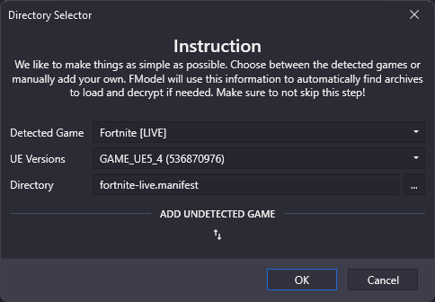
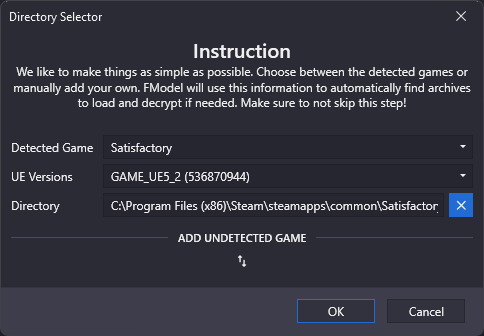
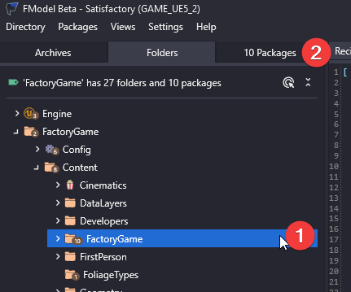

# Extract Icon From Satisfactory

I'll be using [FModel](https://fmodel.app/) to extract the icon from the game.

## Selecting the game

When you first open FModel, you will be greeted with a screen that looks like this:

I've installed the game through steam, if you have installed it through the epic games store, it might be detected automatically.

For Steam:

1. Expand the `Add Undetected Game` Section
2. Give it a name
3. Then under directory paste `C:\Program Files (x86)\Steam\steamapps\common\Satisfactory` for steam. If you have installed it somewhere else, you will need to change the path.
4. Click the **plus** button to add the game.

It should look like this when you are done:

Click on the `Ok` button to continue.

## What to extract

Now that we have the game selected, we can select what we want to extract.
Head into the `FactoryGame-Windows.pak` file.
Right click on each of the following files/folders and select `Save Folder's Packages Textures (.png)`

- `FactoryGame/Content/FactoryGame/Resource/Parts`
- `FactoryGame/Content/FactoryGame/Resource/RawResources`
- `FactoryGame/Content/FactoryGame/Resource/Environment`
- `FactoryGame/Content/FactoryGame/Resource/Equipment/Beacon`
- `FactoryGame/Content/FactoryGame/Buildable`
- `FactoryGame/Content/FactoryGame/Events/Christmas/Parts`
- `FactoryGame/Content/FactoryGame/Events/Christmas/Fireworks`
- `FactoryGame/Content/FactoryGame/IconDesc_PortableMiner_256.uasset`
- `FactoryGame/Content/FactoryGame/Equipment/RebarGun/UI`
- `FactoryGame/Content/FactoryGame/Equipment/Rifle/UI`
- `FactoryGame/Content/FactoryGame/Interface/UI/Assets/MonochromeIcons`

You could also extract at the following folders but this will take a long time to extract:

- `FactoryGame/Content/FactoryGame/Resource`
- `FactoryGame/Content/FactoryGame/Equipment`
- `FactoryGame/Content/FactoryGame/Buildable`
- `FactoryGame/Content/FactoryGame/Events`
- `FactoryGame/Content/FactoryGame/IconDesc_PortableMiner_256.uasset`
- `FactoryGame/Content/FactoryGame/Interface/UI/Assets/MonochromeIcons`

## Unable to find `FactoryGame/Content/FactoryGame/IconDesc_PortableMiner_256.uasset`

Select the `FactoryGame/Content/FactoryGame`, then go to the `Packages` tab.

